# Backend - Open LLM Leaderboard 🏆

FastAPI backend for the Open LLM Leaderboard. This service is part of a larger architecture that includes a React frontend. For complete project installation, see the [main README](../README.md).

## ✨ Features

- 📊 REST API for LLM models leaderboard management
- 🗳️ Voting and ranking system
- 🔄 HuggingFace Hub integration
- 🚀 Caching and performance optimizations

## 🏗 Architecture

```mermaid
flowchart TD
    Client(["**Frontend**<br><br>React Application"]) --> API["**API Server**<br><br>FastAPI REST Endpoints"]

    subgraph Backend
        API --> Core["**Core Layer**<br><br>• Middleware<br>• Cache<br>• Rate Limiting"]
        Core --> Services["**Services Layer**<br><br>• Business Logic<br>• Data Processing"]

        subgraph Services Layer
            Services --> Models["**Model Service**<br><br>• Model Submission<br>• Evaluation Pipeline"]
            Services --> Votes["**Vote Service**<br><br>• Vote Management<br>• Data Synchronization"]
            Services --> Board["**Leaderboard Service**<br><br>• Rankings<br>• Performance Metrics"]
        end

        Models --> Cache["**Cache Layer**<br><br>• In-Memory Store<br>• Auto Invalidation"]
        Votes --> Cache
        Board --> Cache

        Models --> HF["**HuggingFace Hub**<br><br>• Models Repository<br>• Datasets Access"]
        Votes --> HF
        Board --> HF
    end

    style Client fill:#f9f,stroke:#333,stroke-width:2px
    style Models fill:#bbf,stroke:#333,stroke-width:2px
    style Votes fill:#bbf,stroke:#333,stroke-width:2px
    style Board fill:#bbf,stroke:#333,stroke-width:2px
    style HF fill:#bfb,stroke:#333,stroke-width:2px
```



## 🛠️ HuggingFace Datasets

The application uses several datasets on the HuggingFace Hub:

### 1. Requests Dataset (`{HF_ORGANIZATION}/requests`)

- **Operations**:
  - 📤 `POST /api/models/submit`: Adds a JSON file for each new model submission
  - 📥 `GET /api/models/status`: Reads files to get models status
- **Format**: One JSON file per model with submission details
- **Updates**: On each new model submission

### 2. Votes Dataset (`{HF_ORGANIZATION}/votes`)

- **Operations**:
  - 📤 `POST /api/votes/{model_id}`: Adds a new vote
  - 📥 `GET /api/votes/model/{provider}/{model}`: Reads model votes
  - 📥 `GET /api/votes/user/{user_id}`: Reads user votes
- **Format**: JSONL with one vote per line
- **Sync**: Bidirectional between local cache and Hub

### 3. Contents Dataset (`{HF_ORGANIZATION}/contents`)

- **Operations**:
  - 📥 `GET /api/leaderboard`: Reads raw data
  - 📥 `GET /api/leaderboard/formatted`: Reads and formats data
- **Format**: Main dataset containing all scores and metrics
- **Updates**: Automatic after model evaluations

### 4. Maintainers Highlight Dataset (`{HF_ORGANIZATION}/maintainers-highlight`)

- **Operations**:
  - 📥 Read-only access for highlighted models
- **Format**: List of models selected by maintainers
- **Updates**: Manual by maintainers

## 🛠 Local Development

### Prerequisites

- Python 3.9+
- [Poetry](https://python-poetry.org/docs/#installation)

### Standalone Installation (without Docker)

```bash
# Install dependencies
poetry install

# Setup configuration
cp .env.example .env

# Start development server
poetry run uvicorn app.asgi:app --host 0.0.0.0 --port 7860 --reload
```

Server will be available at http://localhost:7860

## ⚙️ Configuration

| Variable     | Description                          | Default     |
| ------------ | ------------------------------------ | ----------- |
| ENVIRONMENT  | Environment (development/production) | development |
| HF_TOKEN     | HuggingFace authentication token     | -           |
| PORT         | Server port                          | 7860        |
| LOG_LEVEL    | Logging level (INFO/DEBUG/WARNING)   | INFO        |
| CORS_ORIGINS | Allowed CORS origins                 | ["*"]       |
| CACHE_TTL    | Cache Time To Live in seconds        | 300         |

## 🔧 Middleware

The backend uses several middleware layers for optimal performance and security:

- **CORS Middleware**: Handles Cross-Origin Resource Sharing
- **GZIP Middleware**: Compresses responses > 500 bytes
- **Rate Limiting**: Prevents API abuse
- **Caching**: In-memory caching with automatic invalidation

## 📝 Logging

The application uses a structured logging system with:

- Formatted console output
- Different log levels per component
- Request/Response logging
- Performance metrics
- Error tracking

## 📁 File Structure

```
backend/
├── app/                  # Source code
│   ├── api/             # Routes and endpoints
│   │   └── endpoints/   # Endpoint handlers
│   ├── core/           # Configurations
│   ├── services/       # Business logic
│   └── utils/          # Utilities
└── tests/              # Tests
```

## 📚 API

Swagger documentation available at http://localhost:7860/docs

### Main Endpoints & Data Structures

#### Leaderboard

- `GET /api/leaderboard/formatted` - Formatted data with computed fields and metadata

  ```typescript
  Response {
    models: [{
      id: string,  // eval_name
      model: {
        name: string,  // fullname
        sha: string,  // Model sha
        precision: string,  // e.g. "fp16", "int8"
        type: string,  // e.g. "fined-tuned-on-domain-specific-dataset"
        weight_type: string,
        architecture: string,
        average_score: number,
        has_chat_template: boolean
      },
      evaluations: {
        ifeval: {
          name: "IFEval",
          value: number,  // Raw score
          normalized_score: number
        },
        bbh: {
          name: "BBH",
          value: number,
          normalized_score: number
        },
        math: {
          name: "MATH Level 5",
          value: number,
          normalized_score: number
        },
        gpqa: {
          name: "GPQA",
          value: number,
          normalized_score: number
        },
        musr: {
          name: "MUSR",
          value: number,
          normalized_score: number
        },
        mmlu_pro: {
          name: "MMLU-PRO",
          value: number,
          normalized_score: number
        }
      },
      features: {
        is_not_available_on_hub: boolean,
        is_merged: boolean,
        is_moe: boolean,
        is_flagged: boolean,
        is_highlighted_by_maintainer: boolean
      },
      metadata: {
        upload_date: string,
        submission_date: string,
        generation: string,
        base_model: string,
        hub_license: string,
        hub_hearts: number,
        params_billions: number,
        co2_cost: number  // CO₂ cost in kg
      }
    }]
  }
  ```

- `GET /api/leaderboard` - Raw data from the HuggingFace dataset
  ```typescript
  Response {
    models: [{
      eval_name: string,
      Precision: string,
      Type: string,
      "Weight type": string,
      Architecture: string,
      Model: string,
      fullname: string,
      "Model sha": string,
      "Average ⬆️": number,
      "Hub License": string,
      "Hub ❤️": number,
      "#Params (B)": number,
      "Available on the hub": boolean,
      Merged: boolean,
      MoE: boolean,
      Flagged: boolean,
      "Chat Template": boolean,
      "CO₂ cost (kg)": number,
      "IFEval Raw": number,
      IFEval: number,
      "BBH Raw": number,
      BBH: number,
      "MATH Lvl 5 Raw": number,
      "MATH Lvl 5": number,
      "GPQA Raw": number,
      GPQA: number,
      "MUSR Raw": number,
      MUSR: number,
      "MMLU-PRO Raw": number,
      "MMLU-PRO": number,
      "Maintainer's Highlight": boolean,
      "Upload To Hub Date": string,
      "Submission Date": string,
      Generation: string,
      "Base Model": string
    }]
  }
  ```

#### Models

- `GET /api/models/status` - Get all models grouped by status
  ```typescript
  Response {
    pending: [{
      name: string,
      submitter: string,
      revision: string,
      wait_time: string,
      submission_time: string,
      status: "PENDING" | "EVALUATING" | "FINISHED",
      precision: string
    }],
    evaluating: Array<Model>,
    finished: Array<Model>
  }
  ```
- `GET /api/models/pending` - Get pending models only
- `POST /api/models/submit` - Submit model

  ```typescript
  Request {
    user_id: string,
    model_id: string,
    base_model?: string,
    precision?: string,
    model_type: string
  }

  Response {
    status: string,
    message: string
  }
  ```

- `GET /api/models/{model_id}/status` - Get model status

#### Votes

- `POST /api/votes/{model_id}` - Vote

  ```typescript
  Request {
    vote_type: "up" | "down",
    user_id: string  // HuggingFace username
  }

  Response {
    success: boolean,
    message: string
  }
  ```

- `GET /api/votes/model/{provider}/{model}` - Get model votes
  ```typescript
  Response {
    total_votes: number,
    up_votes: number,
    down_votes: number
  }
  ```
- `GET /api/votes/user/{user_id}` - Get user votes
  ```typescript
  Response Array<{
    model_id: string,
    vote_type: string,
    timestamp: string
  }>
  ```

## 🔒 Authentication

The backend uses HuggingFace token-based authentication for secure API access. Make sure to:

1. Set your HF_TOKEN in the .env file
2. Include the token in API requests via Bearer authentication
3. Keep your token secure and never commit it to version control

## 🚀 Performance

The backend implements several optimizations:

- In-memory caching with configurable TTL (Time To Live)
- Batch processing for model evaluations
- Rate limiting for API endpoints
- Efficient database queries with proper indexing
- Automatic cache invalidation for votes
