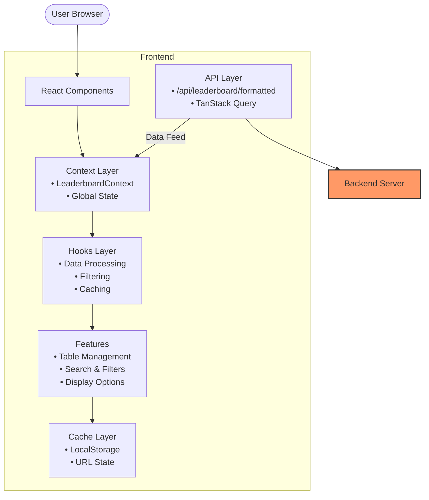

# Frontend - Open LLM Leaderboard 🏆

React interface for exploring and comparing open-source language models.

## 🏗 Architecture



## ✨ Core Features

- 🔍 **Search & Filters**: Real-time filtering, regex search, advanced filters
- 📊 **Data Visualization**: Interactive table, customizable columns, sorting
- 🔄 **State Management**: URL sync, client-side caching (5min TTL)
- 📱 **Responsive Design**: Mobile-friendly, dark/light themes

## 🛠 Tech Stack

- React 18 + Material-UI
- TanStack Query & Table
- React Router v6

## 📁 Project Structure

```
src/
├── pages/
│   └── LeaderboardPage/
│       ├── components/      # UI Components
│       ├── context/        # Global State
│       └── hooks/          # Data Processing
├── components/             # Shared Components
└── utils/                 # Helper Functions
```

## 🚀 Development

```bash
# Install dependencies
npm install

# Start development server
npm start

# Production build
npm run build
```

## 🔧 Environment Variables

```env
# API Configuration
REACT_APP_API_URL=http://localhost:8000
REACT_APP_CACHE_DURATION=300000  # 5 minutes
```

## 🔄 Data Flow

1. API fetches leaderboard data from backend
2. Context stores and manages global state
3. Hooks handle data processing and filtering
4. Components render based on processed data
5. Cache maintains user preferences and URL state
